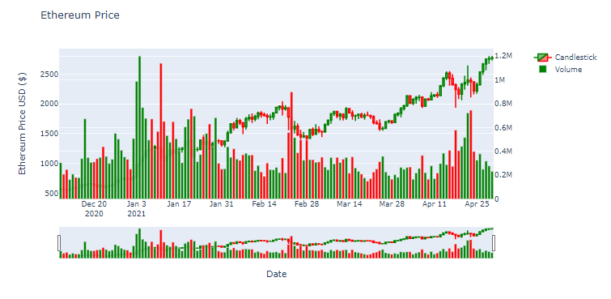
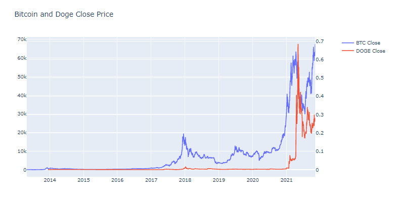

# Technical Analysis / Modelling for Share price and Crypto
Technical analysis learning using candlestick for stock price / Cryptocurrency
This repo will be created for the use of analysis and charting by developer own self.

## Analysis 

```
Section 1: How to use plotly library to produce candlestick pattern and volume for analysis
```




```
Section 2: Plotly comparison between two different crypto charting analysis
```



## Link to website for viewing and keeping track between share and crypto currency
